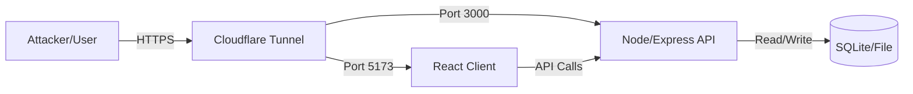

# Vulnerable Payments App - Manual Setup & Development Guide

This guide provides a comprehensive walkthrough of the environment setup, bypassing local `docker-compose` limitations and using Cloudflare Tunnels to expose the application through strict firewalls.

## 🏛️ Architecture Overview

The application is split into two containers that communicate over a Docker network, exposed to the public internet via secure tunnels.



## 🐳 Docker Configuration Explained

### 1. Backend (`/server`)
- **Base Image:** `node:18-alpine`
- **Key Dependencies:** `openssl` (Required for Prisma ORM interactions with the database).
- **Network:** Listens on port `3000`.
- **Database:** Uses a file-based SQLite database (`dev.db`). *Note: In this containerized setup, the DB resets if you delete the container.*

### 2. Frontend (`/client`)
- **Base Image:** `node:18-alpine`
- **Configuration:** Vite server configured with `--host` to allow external connections.
- **Environment:** `VITE_API_BASE_URL` tells the React app where to send API requests (must be the Public Cloudflare URL).

---

## 🚀 Manual Deployment Steps

Run these commands in the project root to start the system from scratch.

### Step 1: Create Infrastructure
Create a shared network so containers can talk to each other.
```bash
docker network create vulnerable-net
```

### Step 2: Deploy Backend
```bash
# Build the server image
docker build -t vulnerable-server ./server

# Run the server
docker run -d \
  --name server \
  --net vulnerable-net \
  -p 3000:3000 \
  -e PORT=3000 \
  -e DATABASE_URL="file:./dev.db" \
  vulnerable-server
```

### Step 3: Deploy Frontend
**Crucial:** You must update the `VITE_API_BASE_URL` below with your actual Backend Cloudflare URL if it changes.
```bash
# Build the client image
docker build -t vulnerable-client ./client

# Run the client
# Replace the URL below with your active Backend Tunnel URL
docker run -d \
  --name client \
  --net vulnerable-net \
  -p 5173:5173 \
  -e VITE_API_BASE_URL="https://point-unlimited-neil-portrait.trycloudflare.com/api" \
  vulnerable-client
```

---

## 🛠️ Development Workflow: Making Changes

Since we are using "snapshot" images (copying files into the image at build time), you must rebuild the container whenever you modify the code.

### 📝 Scenario A: I modified Server code (e.g., `index.ts`)
Run this block to refresh the server:
```bash
echo "♻️ Rebuilding Server..."
docker rm -f server
docker build -t vulnerable-server ./server
docker run -d --name server --net vulnerable-net -p 3000:3000 -e PORT=3000 -e DATABASE_URL="file:./dev.db" vulnerable-server
echo "✅ Server Refreshed!"
```

### 📝 Scenario B: I modified Client code (e.g., `Login.tsx` or `vite.config.ts`)
Run this block to refresh the client:
```bash
echo "♻️ Rebuilding Client..."
docker rm -f client
docker build -t vulnerable-client ./client
docker run -d --name client --net vulnerable-net -p 5173:5173 -e VITE_API_BASE_URL="https://point-unlimited-neil-portrait.trycloudflare.com/api" vulnerable-client
echo "✅ Client Refreshed!"
```

---

## 🌐 Public Access (Cloudflare Tunnels)

To make this accessible via Burp Suite or external tools without firewall blocking, we use `cloudflared`.

**1. Expose Backend:**
```bash
./cloudflared tunnel --url http://localhost:3000
```
*Copy the resulting URL and update `client/src/lib/api.ts` or the Docker env var.*

**2. Expose Frontend:**
```bash
./cloudflared tunnel --url http://localhost:5173
```
*Visit this URL to use the app.*

---

## ❓ Troubleshooting

### 502 Bad Gateway
- **Cause:** Cloudflare can't reach the container.
- **Fix:** Ensure the container is running (`docker ps`). Wait 30s after deployment for the server/client to fully start.

### Login Failed / Network Error
- **Cause:** Frontend is trying to talk to the wrong Backend URL.
- **Fix:**
    1. Check `client/src/lib/api.ts`.
    2. Ensure `baseURL` matches your **current** Cloudflare Backend URL.
    3. If you changed it, you **MUST** rebuild the Client container (Scenario B above).

### Blocked Request (Vite)
- **Cause:** Vite API security blocking the Cloudflare hostname.
- **Fix:** Add the domain to `server.allowedHosts` in `client/vite.config.ts`.
