# Understanding the Tunnel & Docker Architecture

This document explains how your local Docker containers are safely exposed to the internet using Cloudflare Tunnels.

## 1. The High-Level View

Normally, your computers (and Docker containers) are "hidden" behind your home router/firewall. To let someone on the internet access them, you'd usually have to open ports on your router (unsafe).

**Cloudflare Tunnels** act as a secure "outbound" phone call. Instead of letting people call *in* to your computer, your computer calls *out* to Cloudflare. Once that line is open, Cloudflare sends visitor traffic down that open line.

```mermaid
graph LR
    User[🌍 User on Internet] -- HTTPS --> CF[☁️ Cloudflare Edge]
    subgraph Your Computer
        CF -- Secure Tunnel --> Tunnel[cloudflared binary]
        Tunnel -- localhost:3000 --> Backend[🐳 Server Container]
        Tunnel -- localhost:5173 --> Frontend[🐳 Client Container]
    end
```

## 2. Component Breakdown

### A. The Docker Containers (The Destination)
You have two containers running:
1.  **Server (`vulnerable-server`)**:
    *   Runs inside Docker on port `3000`.
    *   Exposed to your host machine via `-p 3000:3000`.
    *   This means `http://localhost:3000` on your host machine hits the backend API.
2.  **Client (`vulnerable-client`)**:
    *   Runs inside Docker on port `5173`.
    *   Exposed to your host machine via `-p 5173:5173`.
    *   This means `http://localhost:5173` on your host machine hits the React frontend.

### B. The `cloudflared` Binary (The Bridge)
This is a small program running directly on your **Linux Host** (not inside Docker). It is started by `start_tunnels.sh`.
*   It creates a secure link to Cloudflare.
*   It says: "Hey Cloudflare, if anyone visits `https://random-name.trycloudflare.com`, send that traffic to me!"
*   When it receives traffic, it forwards it to `localhost:3000` (for backend) or `localhost:5173` (for frontend).

## 3. How They "Link"

The link isn't magic; it's just standard networking.

1.  **Startup (`start_tunnels.sh`)**:
    *   Runs `cloudflared tunnel --url http://localhost:3000`.
    *   `cloudflared` connects to Cloudflare and gets a public URL (e.g., `https://cool-app.trycloudflare.com`).
    *   It starts listening for data from Cloudflare.

2.  **Connection (The Flow)**:
    *   **User** clicks `https://cool-app.trycloudflare.com`.
    *   **Cloudflare** receives the request.
    *   **Cloudflare** pushes the request down the tunnel to your running `cloudflared` process.
    *   **`cloudflared`** makes a local HTTP request to `http://localhost:3000`.
    *   **Docker** receives the request on port 3000 and hands it to your Node.js server.
    *   The **Response** travels the same path in reverse.

## 4. Why We Need `deploy.sh`

The **Frontend** (React) runs in the user's browser, not on your server. When the user's browser wants to talk to your backend, it needs to know *where* the backend is.

1.  `start_tunnels.sh` generates the **Backend URL**.
2.  `deploy.sh` reads this URL from the logs.
3.  It **rebuilds** the Frontend container, "baking in" the backend URL (via `VITE_API_BASE_URL`).
4.  Now, when the React app loads in a user's browser, it knows to send API requests to `https://backend-url.trycloudflare.com`.

## Visualizing the "Baked In" Configuration

